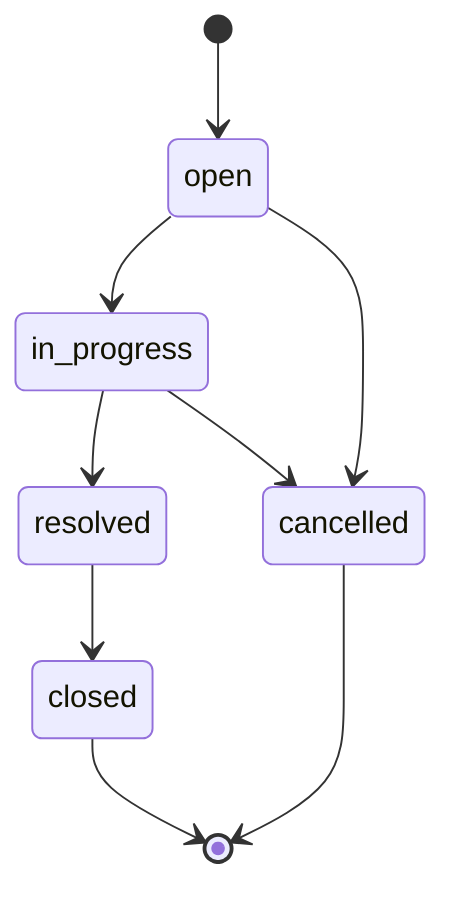

# Design Notes — Support Ticket Management System

## Architecture Overview

```
┌─────────────┐     HTTP/JSON      ┌─────────────┐     Mongoose     ┌─────────────┐
│   React     │ ◄──────────────► │   Express   │ ◄──────────────► │   MongoDB   │
│   (Vite)    │   localhost:5173   │   API :3001 │                  │   Atlas     │
└─────────────┘                    └─────────────┘                  └─────────────┘
```

Three-tier SPA: browser → REST API → document database. No authentication in Core scope.

---

## Frontend Design

| Area | Decision |
|------|----------|
| **Routing** | React Router — `/`, `/tickets/new`, `/tickets/:id` |
| **State** | Local component state + `useEffect` for API calls (no Redux — Core scope) |
| **API client** | Central `services/api.ts` with `ApiError` for backend messages |
| **Search** | Debounced input (300ms) calling `GET /tickets?q=` |
| **Status UI** | Buttons from `GET /allowed-transitions` — never hardcode all statuses |
| **Errors** | `ErrorBanner`, `EmptyState`, loading spinners per page |
| **Styling** | Plain CSS variables — no UI framework (keeps scope small) |

---

## Backend Design

Layered architecture:

```
Route → validate (Zod) → Controller → Service → Mongoose Model
```

| Layer | Responsibility |
|-------|----------------|
| **Routes** | HTTP method + path wiring |
| **Validators** | Zod schemas; parsed data on `req.validated` |
| **Controllers** | Extract validated input, call service, send response |
| **Services** | Business logic, state machine, DB operations |
| **Models** | Mongoose schemas, indexes, text search |

### Why state machine lives in the service layer

- **Single source of truth** — `statusMachine.ts` defines transitions; `ticketService.updateTicketStatus()` enforces them
- **Generic PATCH cannot change status** — `updateTicketSchema` excludes `status`; only `PATCH /:id/status` can transition
- **Testable** — integration tests hit the API and prove backend rejection of invalid moves
- **Frontend is advisory** — UI shows allowed buttons, but backend always validates

---

## Database Design

### Collections

| Collection | Key fields | Indexes |
|------------|------------|---------|
| **users** | name, email, role | `email` (unique) |
| **tickets** | title, description, priority, status, assignedTo, createdBy | `status`, `updatedAt`, text on title+description |
| **comments** | ticketId, message, createdBy | `ticketId` + `createdAt` |

### Seed strategy

- `npm run seed` clears and re-inserts 5 users, 10 tickets, 8 comments
- All emails use `@example.com`
- Tickets cover all five statuses for filter/testing

### Why MongoDB + Mongoose (not Prisma/SQLite)

- Switched mid-project for Atlas cloud persistence and document model fit
- Text index supports keyword search without raw SQL
- Mongoose schemas mirror TypeScript enums for status/priority

---

## Validation Strategy

| Layer | Tool | Examples |
|-------|------|----------|
| **API input** | Zod | Required title, enum status, ObjectId format |
| **Mongoose** | Schema validators | maxlength, required fields |
| **State machine** | Custom | `canTransition(from, to)` before save |

Invalid API input → **400** with `{ error, details? }`.  
Invalid transition → **400** with `"Cannot transition from X to Y"`.  
Not found → **404**.

---

## Error Handling Strategy

- **Backend:** `AppError` class + central `errorHandler` middleware
- **Frontend:** `ApiError` catches JSON error body; `ErrorBanner` displays message
- **Status changes:** Backend error shown verbatim (state machine messages)

---

## Testing Strategy

See [test-strategy.md](./test-strategy.md). Summary:

- **Mandatory:** Jest + Supertest integration tests for state machine (valid + invalid)
- **Additional:** Create validation, search/filter tests
- **Manual:** Smoke script (`npm run smoke:test`), UI checklist in `testing-notes.md`
- **Test DB:** MongoDB Memory Server — no Atlas needed for `npm test`

---

## Key Decisions

1. **Status only via dedicated endpoint** — prevents bypassing state machine
2. **`req.validated` for Express 5** — avoids read-only property errors
3. **Seeded users only** — no user CRUD UI in Core; dropdowns from `GET /users`
4. **Duplicate frontend/backend types** — accepted for Core; shared package is Stretch
5. **No auth** — out of Core scope; focus on workflow artifacts and state machine

---

## Status State Machine



Terminal states: `closed`, `cancelled` — no further transitions.
